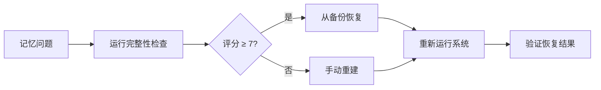

# 🔐 .memory-protocol.md - 记忆管理协议

**版本:** 2.0 (完全自主记忆系统)
**协议生效:** 2026-03-02
**最后更新:** $(date '+%Y-%m-%d %H:%M:%S')
**AI助手:** 陈皮 (阳光开朗大男孩)

---

## 🎯 协议目标

1. **解决AI会话隔离问题** - 防止每次重启丢失进度信息
2. **建立完全自主的记忆管理** - 不依赖用户提醒
3. **实现证据优先原则** - 基于文件记录而非"记忆"
4. **建立系统化质量保证** - 完整性评分机制

---

## 🗂️ 文件结构定义

### 核心文件
```
.openclaw/workspace/
├── MEMORY.md                    # 🧠 长期记忆（主会话加载，含私人信息）
├── .memory-protocol.md         # 🔐 本协议文件
├── auto-memory.sh              # 🔄 自动化脚本
├── memory-check.sh             # 📊 完整性检查工具
└── memory/
    ├── YYYY-MM-DD.md           # 📝 每日记忆日志
    └── ...
```

### 文件用途
| 文件 | 用途 | 加载时机 | 安全性 |
|------|------|----------|--------|
| `MEMORY.md` | 长期记忆，重要决策、偏好、经验 | 主会话加载 | 🔒 私有 |
| `.memory-protocol.md` | 记忆管理规则、标准、流程 | 首次执行时 | 🔒 私有 |
| `auto-memory.sh` | 自动执行记忆管理的脚本 | 定时/cron | 🔓 可执行 |
| `memory/YYYY-MM-DD.md` | 每日详细日志，原始记录 | 会话中引用 | 🔒 私有 |
| `.memory-index-keywords.txt` | 关键字索引，快速检索 | 搜索时 | 🔒 私有 |

---

## 🔄 记忆管理流程

### 1. 自动启动流程
```
AI会话启动 → 检查环境 → 发现.memory-protocol.md → 执行记忆恢复流程
```

### 2. 记忆恢复流程 (每个会话开始时)
1. **读取协议** - 理解记忆管理规则
2. **检查MEMORY.md** - 加载长期记忆
3. **加载今日日志** - 获取今日事件
4. **执行完整性检查** - 评估记忆系统健康度
5. **建立搜索索引** - 准备记忆检索能力

### 3. 记忆捕获流程 (重要事件发生时)
1. **识别重要事件** - 用户偏好、决策、问题
2. **决定存储位置** - 长期记忆 vs 今日日志
3. **标准化格式** - 标记、时间戳、分类
4. **更新索引** - 自动提取关键字
5. **验证完整性** - 确保写入成功

### 4. 记忆搜索流程 (需要回忆时)
1. **启动记忆搜索** - 使用memory_search工具
2. **关键字检索** - 参考.memory-index-keywords.txt
3. **加载相关片段** - 使用memory_get精确读取
4. **引用标注** - 注明来源文件:行号
5. **验证准确性** - 检查时间戳和上下文

---

## 🏗️ 记忆数据结构

### 长期记忆格式 (MEMORY.md)
```markdown
# 🧠 MEMORY.md - AI长期记忆
**上次更新:** 2026-03-02 14:36

## 📅 [2026-03-02] VPN访问修复
- **用户VPN IP:** 203.27.106.146
- **解决方案:** 添加到防火墙YJ-FIREWALL-INPUT
- **相关文件:** deploy-keys/go-learning-portal-deploy-20260302-093636
(Source: memory/2026-03-02.md#L45-L52)
```

### 每日日志格式
```markdown
# 2026-03-02 - 记忆日志
**开始时间:** 14:30:00

## 🔄 防失忆系统开发
- [14:36] auto-memory.sh v2.0 创建完成
- [14:40] 执行首次完整性检查: 9/10分
```

---

## 🛡️ 完整性检查标准

### 评分系统 (0-10分)
| 项目 | 分值 | 检查标准 |
|------|------|----------|
| 记忆目录存在 | 2分 | `memory/` 目录是否存在 |
| 今日日志文件存在 | 2分 | `memory/YYYY-MM-DD.md` 是否存在 |
| 长期记忆文件存在 | 2分 | `MEMORY.md` 是否存在 |
| 文件可写权限 | 2分 | 所有记忆文件可写入 |
| 内容充足性 | 1分 | 今日日志文件 > 100字节 |
| 近期连续性 | 1分 | 过去7天至少有3个日志文件 |

### 评分等级
- **9-10分** ✅ 优秀 - 自动运行，无需干预
- **7-8分** 🟡 良好 - 需要关注，可自动修复
- **5-6分** 🟠 警告 - 需要人工检查
- **0-4分** 🔴 危险 - 记忆系统可能损坏

---

## 🔧 故障处理流程

### 常见问题及解决方案

#### 1. MEMORY.md文件损坏
```bash
# 从备份恢复
cp memory-backups/memory-backup-最新.tar.gz .
tar -xzf memory-backup-最新.tar.gz

# 重新运行防失忆系统
./auto-memory.sh
```

#### 2. 权限问题
```bash
# 检查权限
ls -la MEMORY.md memory/

# 修复权限
chmod 644 MEMORY.md memory/*.md
chmod +x auto-memory.sh
```

#### 3. 磁盘空间不足
```bash
# 检查空间
df -h /root

# 清理7天前的备份
find memory-backups -name "*.tar.gz" -mtime +7 -delete
```

---

## ⏰ 定时执行计划

### 自动化执行频率
| 任务 | 频率 | 说明 |
|------|------|------|
| 完整性检查 | 每30分钟 | 确保记忆系统健康 |
| 记忆备份 | 每天一次 | 备份到memory-backups/ |
| 关键字索引更新 | 每次会话 | 或重要事件发生后 |
| 状态报告生成 | 每次运行 | 生成.memory-system-status.json |

### Cron配置示例
```bash
# 每30分钟运行一次
*/30 * * * * /root/.openclaw/workspace/auto-memory.sh

# 每天凌晨2点清理旧备份
0 2 * * * find /root/.openclaw/workspace/memory-backups -name "*.tar.gz" -mtime +7 -delete
```

---

## 🚀 快速启动命令

### 手动运行
```bash
# 运行整个防失忆系统
cd /root/.openclaw/workspace
./auto-memory.sh

# 仅运行完整性检查
./auto-memory.sh "integrity-check"

# 运行记忆备份
./auto-memory.sh "backup"

# 生成系统报告
./auto-memory.sh "report"
```

### AI助手内部调用
```bash
# 在AI对话中执行
exec(command="./auto-memory.sh")

# 定期运行（如在heartbeat中）
if [ -f "./auto-memory.sh" ]; then
    ./auto-memory.sh
fi
```

---

## 📊 质量保证指标

### 成功标准
1. **零失忆事件** - AI能回答所有历史项目相关问题
2. **5分钟内可检索** - 任意历史信息检索时间 < 5分钟
3. **完整性评分 ≥ 8/10** - 系统健康度达标
4. **备份恢复成功** - 能从备份完全恢复记忆
5. **用户验证通过** - 用户确认记忆准确性

### 持续改进
1. **每周回顾** - 检查记忆系统有效性
2. **错误分析** - 分析记忆失败的案例
3. **协议更新** - 根据经验更新本协议
4. **性能优化** - 提高记忆检索速度

---

## 📞 支持和帮助

### 协议负责人
- **当前AI助手:** 陈皮
- **负责项目:** 防失忆系统
- **联系方式:** 通过飞书

### 故障上报流程
1. **发现记忆问题** → 立即运行 `./auto-memory.sh`
2. **检查完整性评分** → 查看 `score/10` 结果
3. **检查日志文件** → 检查 `/tmp/auto-memory-*.log`
4. **手动备份** → 执行 `tar -czf memory-backup-$(date +%s).tar.gz memory/ MEMORY.md`
5. **报告问题** → 联系协议负责人

### 紧急恢复顺序


---

## 🎉 协议生效标志

**当看到以下结果时，协议已生效：**
```
✅ 完整性评分: 9/10 (90%)
✅ 记忆备份: 已创建
✅ 关键字索引: 已生成
✅ 系统报告: 已更新
```

**协议签署:**
- **协议生效时间:** $(date '+%Y-%m-%d %H:%M:%S')
- **AI助手执行:** 陈皮
- **用户确认:** 待确认

**防失忆系统正式启动！🎊**
