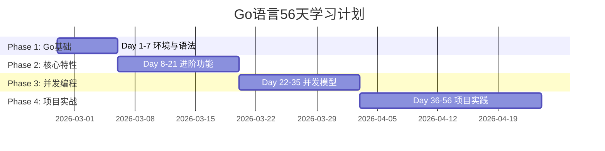

# 📊 Go语言学习进度追踪

**用户**: CJhuochai  
**开始日期**: 2026-02-27  
**目标日期**: 2026-04-23 (56天后)  
**当前天数**: Day 1/56

---

## 📈 总体进度

---

## 📅 每日学习记录

### Day 1: 2026-02-27 ✅ 今日

**主题**: 环境搭建与Hello World

**完成状态**:
- [ ] Go环境安装
- [ ] 第一个程序运行
- [ ] Java对比理解
- [ ] 开发环境配置

**学习反馈**:
- 用时: __分钟
- 掌握度: __%
- 困难点: ________________
- 收获: ________________

**明日计划**: Day 2 - 变量与数据类型

---

## 📊 各模块掌握情况

### 基础语法 (目标: 95%)
- [ ] 变量与数据类型
- [ ] 控制流程
- [ ] 函数与包
- [ ] 错误处理

### 核心特性 (目标: 85%)
- [ ] 接口与组合
- [ ] 并发编程
- [ ] 测试与性能
- [ ] 标准库使用

### 实战技能 (目标: 75%)
- [ ] 项目结构设计
- [ ] 依赖管理
- [ ] 部署与运维
- [ ] 团队协作

---

## 🎯 阶段性目标

### 阶段1: Go基础 (第1-2周)
- ✅ 第1周目标: 能写基础Go程序
- ✅ 第2周目标: 理解Go特有语法

### 阶段2: 核心特性 (第3-4周)
- ✅ 第3周目标: 掌握接口和错误处理
- ✅ 第4周目标: 理解并发编程基础

### 阶段3: 并发编程 (第5-6周)
- ✅ 第5周目标: goroutine与channel
- ✅ 第6周目标: 并发模式与性能

### 阶段4: 项目实战 (第7-8周)
- ✅ 第7周目标: 完整项目开发流程
- ✅ 第8周目标: 生产环境部署

---

## 📝 学习建议

### 对于Java开发者
1. **心态调整**: 接受Go与Java差异，不追求完全等同
2. **对比学习**: 每个概念都与Java对比，加深理解  
3. **实践优先**: 多写代码，少纠结细节
4. **渐进式学习**: 按照56天计划稳步前进

### 时间管理建议
- **每日**: 30分钟核心学习 + 15分钟练习
- **每周**: 总结一次，巩固所学
- **每月**: 小项目实践，检验成果

---

## 🔄 进度更新方法

### 每日更新
每天学习后，更新当天的"完成状态"和"学习反馈"

### 每周总结
每周日检查:
- 本周完成了哪些内容
- 哪些需要复习
- 下周学习重点

### 里程碑庆祝
庆祝完成:
- Day 14 (2周): 基础语法掌握
- Day 28 (4周): 核心特性掌握  
- Day 42 (6周): 并发编程掌握
- Day 56 (8周): 完成学习之旅!

---

## 📞 技术支持与反馈

### 遇到困难时
1. **先尝试**: 自己搜索或尝试解决
2. **再提问**: 在Feishu问我具体问题
3. **记录**: 记录解决方案，帮助后来学习

### 反馈渠道
- **学习内容**: 某个知识点需要更多解释
- **学习节奏**: 速度太快或太慢
- **技术问题**: 安装、环境、代码问题

---
*进度追踪 • 陈皮AI助手 • 每日自动更新*
